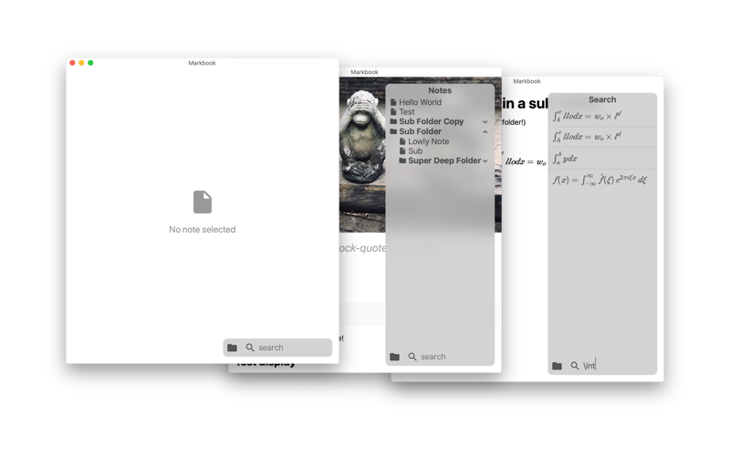

# Markbook



Markbook is a markdown viewer. You can open any folder containing some `.md` files to
browse and search your notes in a nice user interface.

Markbook supports LaTeX-Style equations (`$a+b=c$`) and standard markdown. The app is currently
only available for macOS.

## Build instructions

Make sure you have the following installed:
- GNU Make
- gcc / clang / other C compiler
- nasm assembler
- NodeJS and NPM

Then run:
```bash
$ make # to build a binary or ...
$ make app # to build a macOS application bundle.
```
